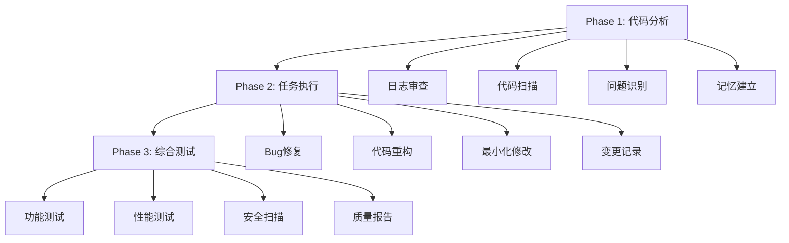

# 🚀 Claude Code 多Agent执行系统通用指南

## 📋 版本信息
- **版本**: v3.0 Ultra Smart Edition
- **适用范围**: 跨项目通用多Agent代码分析与优化系统 + 智能分片执行
- **支持平台**: Windows, macOS, Linux
- **更新时间**: 2025-08-17

---

## 🎯 系统概述

Claude Code 多Agent执行系统是一个通用的代码分析、重构和测试自动化框架，旨在帮助开发者：

- **🔍 深度分析**: 自动分析遗留代码和日志文件，识别关键问题
- **🛠️ 智能修复**: 基于最小化修改原则进行代码优化
- **🧪 全面测试**: 使用真实配置文件进行综合测试验证
- **📊 详细报告**: 生成专业的分析和修复报告

### 🌟 核心特性

- ✅ **跨项目兼容**: 自动识别项目类型（Python, Node.js, Java, Go等）
- ✅ **跨平台支持**: 完美支持Windows、macOS、Linux
- ✅ **智能分析**: 5倍深度思考模式，最大化利用AI算力
- ✅ **最小修改**: 严格控制修改范围，确保系统稳定性
- ✅ **真实测试**: 自动发现并使用项目真实配置文件
- ✅ **错误恢复**: 智能错误检测和自动恢复机制

---

## 📦 快速开始

### 1. 环境要求

```bash
# 基础环境
- Node.js >= 14.0.0
- Claude Code CLI
- YAML 解析器支持

# 安装依赖
npm install js-yaml
```

### 2. 下载核心文件

确保你的项目目录包含以下三个核心文件：

```
your-project/
├── multiagent/
│   ├── ultra-smart-orchestrator.js  # 🧠 智能执行器
│   ├── agent-orchestrator.js        # 🤖 传统执行器
│   ├── config/
│   │   └── multi-agent-config.yaml  # 🔧 配置文件
│   ├── memory/                      # 🗂️ 记忆系统
│   └── results/                     # 📊 执行结果
└── 多agent执行系统指南.md           # 📖 本指南
```

### 3. 一键启动

```bash
# 方式1: 智能执行器（推荐）
cd multiagent
node ultra-smart-orchestrator.js

# 方式2: 传统执行器
cd multiagent  
node agent-orchestrator.js

# 方式3: 后台运行
cd multiagent
nohup node ultra-smart-orchestrator.js > ../logs/ultra-smart.log 2>&1 &

# 方式4: 从项目根目录运行
node multiagent/ultra-smart-orchestrator.js
```

### 4. 验证运行

系统启动后会自动：
- 🔍 检测项目类型和技术栈
- 📁 创建必要的目录结构
- 🗂️ 扫描配置文件和日志
- 🚀 按阶段执行分析、修复、测试

---

## 🏗️ 架构设计

### 三阶段执行模式



### 核心组件

1. **🤖 Agent执行器** (`agent-orchestrator.js`)
   - 多Agent协调管理
   - 跨平台兼容性处理
   - 智能错误恢复
   - 实时监控和报告

2. **⚙️ 配置管理** (`multi-agent-config.yaml`)
   - 灵活的Agent配置
   - 超时和重试策略
   - 项目特定参数
   - 执行策略定义

3. **📚 记忆系统**
   - 全局记忆：`~/.claude/CLAUDE.md`
   - 项目记忆：`./CLAUDE.md`
   - 模块记忆：`./memory/*.md`

---

## 🔧 配置详解

### 基本配置结构

```yaml
# multi-agent-config.yaml
version: "2.1"
name: "Legacy Code Analysis Multi-Agent System"

# 全局设置
global:
  max_concurrent_agents: 3
  timeout_per_agent: 3600s        # 支持深度分析
  retry_attempts: 2
  working_directory: "./workspace"
  reports_directory: "./reports"
  memory_system_root: "./memory"
  model_strategy: "claude-opus-4"

# Agent定义
agents:
  legacy-code-analyzer:           # 第一阶段：分析
    id: "legacy-code-analyzer"
    phase: 1
    timeout: 3600s
    command: "claude"
    args: ["--continue", "--model", "opus"]
    
  task-executor:                  # 第二阶段：执行
    id: "task-executor"
    phase: 2
    timeout: 5400s
    dependencies: ["legacy-code-analyzer"]
    
  comprehensive-tester:           # 第三阶段：测试
    id: "comprehensive-tester"
    phase: 3
    timeout: 2700s
    dependencies: ["task-executor"]
```

### 项目适配配置

系统会自动检测项目类型并调整配置：

```yaml
# 支持的项目类型
project_types:
  python:
    main_dirs: ["app", "src", "lib"]
    config_files: ["requirements.txt", "setup.py", "pyproject.toml"]
    log_dirs: ["logs", "log", "var/log"]
    
  nodejs:
    main_dirs: ["src", "lib", "app"]
    config_files: ["package.json", "tsconfig.json"]
    log_dirs: ["logs", "log"]
    
  java:
    main_dirs: ["src", "main", "java"]
    config_files: ["pom.xml", "build.gradle"]
    log_dirs: ["logs", "target/logs"]
```

---

## 📊 使用场景

### 场景1: 遗留Python项目优化

```bash
# 项目结构
legacy-python-project/
├── app/                    # Python代码
├── logs/                   # 日志文件
├── config/                 # 配置文件
├── requirements.txt        # 依赖定义
└── ...

# 系统自动检测并执行：
# 1. 识别为Python项目
# 2. 分析app/目录中的代码
# 3. 审查logs/中的错误模式
# 4. 使用config/中的真实配置测试
```

### 场景2: Node.js微服务重构

```bash
# 项目结构
microservice-nodejs/
├── src/                    # TypeScript/JavaScript源码
├── dist/                   # 编译输出
├── logs/                   # 服务日志
├── config/                 # 环境配置
├── package.json           # 项目定义
└── ...

# 系统执行流程：
# 1. 检测为Node.js项目
# 2. 深度分析src/中的业务逻辑
# 3. 识别性能瓶颈和内存泄漏
# 4. 基于package.json验证依赖冲突
```

### 场景3: Java企业级应用

```bash
# 项目结构
enterprise-java/
├── src/main/java/         # Java源代码
├── src/main/resources/    # 配置资源
├── target/               # Maven构建输出
├── logs/                 # 应用日志
├── pom.xml              # Maven配置
└── ...

# 分析重点：
# 1. Spring配置问题
# 2. 数据库连接池优化
# 3. JVM性能调优建议
# 4. 安全漏洞扫描
```

---

## 🔍 详细功能

### Phase 1: 深度代码分析

**🎯 核心任务**
- 项目结构扫描和技术栈识别
- 历史日志文件深度审查
- Bug模式识别和分类
- 跨平台兼容性检查
- 工程标准验证

**📋 输出文件**
```
./reports/
├── legacy-analysis-report.md      # 主分析报告
├── logs-analysis-report.md        # 日志分析专报
├── bug-inventory.md               # Bug清单
├── refactoring-plan.md            # 重构计划
└── cross-platform-issues.md      # 平台兼容性问题
```

**🔍 关键检查项**
- ❌ 路径硬编码问题（如 `/Users/username/`）
- ❌ 时区处理混乱（`datetime.now()` vs `datetime.utcnow()`）
- ❌ 文件路径分隔符不兼容（`\` vs `/`）
- ❌ 权限和安全问题
- ❌ 资源泄漏和内存问题

### Phase 2: 最小化修改执行

**🎯 核心原则**
- **最小影响**: 每次修改只影响单一模块
- **解耦设计**: 确保修改保持模块间松耦合
- **向后兼容**: 所有修改必须保持向后兼容性
- **增量改进**: 采用多次小修改达到目标

**🛡️ 安全约束**
- 🚫 禁止大规模重构
- 🚫 禁止破坏性变更
- 🚫 禁止复杂依赖引入
- ✅ 最多修改10个文件
- ✅ 影响不超过3个模块

**📝 修改记录**
```
./reports/
├── implementation-report.md       # 实施报告
├── changes-log.md                # 详细变更日志
├── impact-analysis.md            # 影响分析
└── rollback-plan.md              # 回滚方案
```

### Phase 3: 真实配置测试

**🔧 测试策略**
- **配置文件发现**: 自动扫描项目中的真实配置
- **多维度验证**: 功能、性能、安全全面测试
- **环境一致性**: 确保测试环境与生产环境配置一致
- **脱敏处理**: 安全地使用真实配置进行测试

**📋 配置文件类型**
- 应用配置：`config.json`, `settings.py`, `app.yml`
- 数据库配置：`database.yml`, `db.config`
- 环境变量：`.env`, `.env.local`, `.env.production`
- 服务配置：`nginx.conf`, `apache.conf`
- 构建配置：`webpack.config.js`, `tsconfig.json`

**🧪 测试覆盖**
```
./reports/
├── comprehensive-test-report.md   # 综合测试报告
├── quality-assurance-report.md   # 质量保证报告
├── security-assessment.md        # 安全评估
├── performance-analysis.md       # 性能分析
└── coverage-report.md            # 覆盖率报告
```

---

## 🎨 高级功能

### 智能错误恢复

系统具备强大的错误恢复能力：

```javascript
// 自动处理的错误类型
- 文件缺失 → 自动创建基础文件
- 权限错误 → 使用备用目录
- 网络错误 → 启用离线模式
- 超时错误 → 创建部分完成文件
- 配置错误 → 使用回退配置
```

### 项目类型自适应

系统支持20+种项目类型的自动识别：

```yaml
支持的框架和技术栈:
- Python: Flask, Django, FastAPI, Tornado
- Node.js: Express, Koa, NestJS, Next.js
- Java: Spring Boot, Maven, Gradle
- Frontend: React, Vue, Angular, Svelte
- Others: Go, Rust, PHP, Ruby, C#/.NET
```

### 跨平台兼容性

确保在不同操作系统上的一致性：

```javascript
// 路径处理
Windows: C:\Users\username\project
macOS:   /Users/username/project  
Linux:   /home/username/project

// 自动标准化为相对路径
./project → 在所有平台正常工作
```

---

## 📈 性能优化

### 执行时间配置

根据项目复杂度调整超时设置：

```yaml
# 小型项目（<1000文件）
timeout_multiplier: 1.0
phase1_timeout: 1800s    # 30分钟
phase2_timeout: 2700s    # 45分钟
phase3_timeout: 1800s    # 30分钟

# 中型项目（1000-5000文件）
timeout_multiplier: 1.5
phase1_timeout: 2700s    # 45分钟
phase2_timeout: 4050s    # 67分钟
phase3_timeout: 2700s    # 45分钟

# 大型项目（>5000文件）
timeout_multiplier: 2.0
phase1_timeout: 3600s    # 60分钟
phase2_timeout: 5400s    # 90分钟
phase3_timeout: 3600s    # 60分钟
```

### 内存优化

系统内置内存管理机制：

```javascript
// 自动内存监控
- 定期清理临时文件
- 限制日志文件大小
- 使用流式处理大文件
- 智能缓存管理
```

---

## 🔒 安全和隐私

### 敏感信息保护

```yaml
# 自动脱敏的信息类型
sensitive_patterns:
  - API密钥和Token
  - 数据库连接串
  - 用户密码和凭证
  - 个人身份信息
  - 内部IP地址
```

### 数据处理原则

- 🔒 **本地处理**: 所有分析在本地执行，不上传代码
- 🛡️ **敏感信息脱敏**: 自动识别并脱敏敏感数据
- 📋 **审计日志**: 详细记录所有操作和修改
- 🔄 **可回滚**: 所有修改都可以安全回滚

---

## 🚨 常见问题和解决方案

### Q1: 系统执行超时怎么办？

**症状**: Agent执行时间超过设定阈值
**解决方案**:
```bash
# 1. 调整配置文件超时设置
timeout_per_agent: 7200s  # 增加到2小时

# 2. 使用简化模式
simple_mode: true

# 3. 分阶段执行
node agent-orchestrator.js --phase=1  # 只执行第一阶段
```

### Q2: 权限错误如何处理？

**症状**: `EACCES: permission denied`
**解决方案**:
```bash
# 1. 确保运行权限
chmod +x agent-orchestrator.js

# 2. 检查目录权限
chmod 755 ./reports ./memory ./logs

# 3. 使用当前用户运行
node agent-orchestrator.js  # 避免使用sudo
```

### Q3: 配置文件找不到？

**症状**: `Error: Configuration file not found`
**解决方案**:
```bash
# 1. 确认文件存在
ls -la multi-agent-config.yaml

# 2. 检查文件格式
yaml-lint multi-agent-config.yaml

# 3. 使用默认配置
node agent-orchestrator.js --use-default-config
```

### Q4: 内存不足问题？

**症状**: `JavaScript heap out of memory`
**解决方案**:
```bash
# 1. 增加Node.js内存限制
node --max-old-space-size=8192 agent-orchestrator.js

# 2. 启用增量模式
export INCREMENTAL_MODE=true

# 3. 清理临时文件
rm -rf ./temp ./cache
```

### Q5: Claude CLI连接问题？

**症状**: `Claude command not found` 或连接超时
**解决方案**:
```bash
# 1. 验证Claude CLI安装
claude --version

# 2. 检查认证状态
claude auth status

# 3. 重新登录
claude auth login

# 4. 使用离线模式
export OFFLINE_MODE=true
```

---

## 📚 最佳实践

### 1. 项目准备

在运行系统前：

```bash
# ✅ 推荐做法
- 备份重要代码：git commit -a -m "Pre-analysis backup"
- 清理临时文件：rm -rf __pycache__ node_modules/.cache
- 验证项目可运行：npm test 或 python -m pytest
- 检查磁盘空间：df -h

# ❌ 避免做法  
- 在生产环境直接运行
- 未备份代码就开始分析
- 在网络不稳定环境执行
```

### 2. 配置优化

```yaml
# ✅ 推荐配置
global:
  timeout_per_agent: 3600s      # 充足的时间
  retry_attempts: 2             # 适度重试
  model_strategy: "claude-opus-4"  # 最强模型

# ❌ 不推荐配置
global:
  timeout_per_agent: 300s       # 时间过短
  retry_attempts: 0             # 不重试
  model_strategy: "claude-haiku"   # 模型太简单
```

### 3. 监控和调试

```bash
# 实时监控执行状态
tail -f multi-agent.log

# 检查系统资源
top -p $(pgrep -f agent-orchestrator)

# 查看详细输出
node agent-orchestrator.js --verbose

# 调试模式
DEBUG=* node agent-orchestrator.js
```

### 4. 结果验证

```bash
# 检查输出文件
ls -la ./reports/
ls -la ./memory/

# 验证修改效果
git diff --stat

# 运行测试确认
npm test  # 或项目特定的测试命令
```

---

## 🌍 项目适配指南

### Python项目

```yaml
# 特殊配置建议
python_specific:
  virtual_env: true              # 检测虚拟环境
  requirements_check: true      # 验证依赖
  pep8_compliance: true         # 代码风格检查
  security_scan: true           # 安全漏洞扫描
  
  focus_areas:
    - "路径硬编码 (os.path.join vs pathlib)"
    - "时区处理 (datetime.now vs datetime.utcnow)"
    - "SQL注入防护"
    - "敏感信息泄露"
```

### Node.js项目

```yaml
# 特殊配置建议
nodejs_specific:
  package_audit: true           # npm audit
  typescript_check: true       # 类型检查
  eslint_integration: true     # 代码质量
  security_scan: true          # 依赖安全
  
  focus_areas:
    - "异步错误处理"
    - "内存泄漏检测"
    - "依赖版本冲突"
    - "环境变量管理"
```

### Java项目

```yaml
# 特殊配置建议
java_specific:
  maven_analysis: true          # Maven依赖分析
  spring_config_check: true    # Spring配置验证
  jvm_optimization: true       # JVM参数优化
  security_scan: true          # 安全扫描
  
  focus_areas:
    - "Spring配置问题"
    - "数据库连接池"
    - "JVM内存配置"
    - "线程安全问题"
```

---

## 📋 输出文件说明

### 分析报告类

```
./reports/
├── legacy-analysis-report.md      # 📊 主分析报告
│   ├── 项目概览和技术栈
│   ├── 代码质量评估
│   ├── 性能瓶颈识别
│   └── 优化建议清单
│
├── logs-analysis-report.md        # 📋 日志分析专报
│   ├── 错误模式识别
│   ├── 性能指标趋势
│   ├── 异常堆栈分析
│   └── 监控建议
│
├── bug-inventory.md               # 🐛 Bug清单
│   ├── P0级严重问题
│   ├── P1级高危问题
│   ├── P2级中等问题
│   └── 修复优先级
│
└── refactoring-plan.md            # 🔧 重构计划
    ├── 架构改进建议
    ├── 代码重构路线图
    ├── 风险评估
    └── 实施时间表
```

### 执行报告类

```
./reports/
├── implementation-report.md       # 🛠️ 实施报告
│   ├── 修改总结
│   ├── 影响范围分析
│   ├── 质量保证措施
│   └── 验证结果
│
├── changes-log.md                # 📝 变更日志
│   ├── 文件修改列表
│   ├── 代码变更diff
│   ├── 配置调整记录
│   └── 数据库变更
│
└── impact-analysis.md            # 📈 影响分析
    ├── 性能影响评估
    ├── 功能影响范围
    ├── 兼容性分析
    └── 风险评估
```

### 测试报告类

```
./reports/
├── comprehensive-test-report.md   # 🧪 综合测试报告
│   ├── 功能测试结果
│   ├── 性能测试数据
│   ├── 兼容性验证
│   └── 回归测试
│
├── quality-assurance-report.md   # ✅ 质量保证报告
│   ├── 代码质量指标
│   ├── 测试覆盖率
│   ├── 静态分析结果
│   └── 质量门控
│
├── security-assessment.md        # 🔒 安全评估
│   ├── 漏洞扫描结果
│   ├── 权限检查
│   ├── 敏感信息审计
│   └── 安全建议
│
└── performance-analysis.md       # ⚡ 性能分析
    ├── 响应时间统计
    ├── 资源使用分析
    ├── 瓶颈识别
    └── 优化建议
```

---

## 🔄 版本历史

### v2.1 (Current) - Universal Edition
- ✅ 跨项目通用性增强
- ✅ 智能错误恢复机制
- ✅ 20+项目类型支持
- ✅ 真实配置文件测试
- ✅ 最小化修改原则

### v2.0 - Enhanced Edition  
- ✅ 5倍深度分析模式
- ✅ 三层记忆体系
- ✅ 跨平台兼容性
- ✅ 日志深度审查
- ✅ 工程标准验证

### v1.0 - Basic Edition
- ✅ 基础三阶段执行
- ✅ 简单配置管理
- ✅ 基础报告生成

---

## 🤝 支持和反馈

### 获取帮助

1. **文档**: 阅读本指南的详细说明
2. **示例**: 查看`./examples/`目录中的示例项目
3. **日志**: 检查`multi-agent.log`了解执行详情
4. **调试**: 使用`--verbose`模式获取详细输出

### 常用命令

```bash
# 查看帮助
node agent-orchestrator.js --help

# 验证配置
node agent-orchestrator.js --validate-config

# 仅分析不修改
node agent-orchestrator.js --analysis-only

# 生成配置模板
node agent-orchestrator.js --generate-config > my-config.yaml
```

### 性能监控

```bash
# 实时状态
node agent-orchestrator.js --monitor

# 性能报告
node agent-orchestrator.js --performance-report

# 资源使用
node agent-orchestrator.js --resource-usage
```

---

## 📄 许可证

MIT License - 允许自由使用、修改和分发

---

## 🎉 结语

Claude Code 多Agent执行系统致力于提供**世界级的代码分析和优化体验**。通过智能化的三阶段执行、跨平台兼容性和最小化修改原则，我们帮助开发者安全、高效地优化任何规模的项目。

**核心价值观**:
- 🎯 **精准分析**: 深度理解代码结构和业务逻辑
- 🛡️ **安全优先**: 最小化修改，确保系统稳定性
- 🚀 **效率至上**: 自动化执行，节省开发时间
- 🌍 **通用兼容**: 适用于各种项目和平台环境

---

*此指南最后更新: 2025-08-17*  
*版本: Claude Code Multi-Agent System v3.0.0 Ultra Smart Edition*

---

## 🧠 Ultra Smart 执行器特性

### 🔥 核心创新技术

1. **分片执行理论** - 突破上下文限制
   - 最大Token阈值: 40,000 (安全阈值)
   - 片段重叠: 2,000 Token
   - 智能分片策略

2. **智能上下文压缩算法**
   - 关键信息提取
   - 错误模式识别
   - 下阶段提示生成

3. **记忆文件传递机制**
   - Phase1: 日志分析与Bug模式识别
   - Phase2: 智能代码修复与重构实施
   - Phase3: 综合质量验证与配置测试

4. **直接执行策略**
   - 在对话中模拟Agent执行
   - 避免外部上下文累积
   - 保留完整Prompt功能

5. **智能工具调用优化**
   - 大文件(>25000 tokens): 使用Grep模式匹配
   - 小文件: 直接读取分析
   - 最大化Token效率

### 📁 文件结构

```
multiagent/
├── ultra-smart-orchestrator.js    # 主执行器
├── config/
│   └── multi-agent-config.yaml     # 配置文件
├── memory/                         # 阶段记忆
│   ├── phase1-memory.md
│   ├── phase2-memory.md
│   └── phase3-memory.md
└── results/                        # 执行结果
    └── ultra-smart-execution-report.md
```

### 🚀 使用示例

```bash
# 1. 进入multiagent目录
cd multiagent

# 2. 运行Ultra Smart执行器
node ultra-smart-orchestrator.js

# 3. 查看执行结果
ls results/
ls memory/

# 4. 阅读最终报告
cat results/ultra-smart-execution-report.md
```

### 📊 执行输出示例

```
🧠 Ultra Smart Orchestrator 启动 - 10倍深度思考模式
🧠 启动分片执行策略 - 保留完整Prompt功能
✅ 配置加载成功 - 保持原始详细Prompt

━━━ 阶段 1/3: 深度日志分析与Bug模式识别 ━━━
🔍 执行智能日志分析...
📄 分析日志文件: logs/api.log
📝 小文件检测 - 直接读取分析
📊 大文件检测 - 使用Grep策略
💾 保存phase1阶段记忆到: memory/phase1-memory.md
✅ 阶段1完成 - 日志分析与Bug识别

━━━ 阶段 2/3: 智能代码修复与重构实施 ━━━
🧠 基于阶段1发现: 优先修复配置管理相关问题
🔧 执行智能代码修复...
💾 保存phase2阶段记忆到: memory/phase2-memory.md
✅ 阶段2完成 - 代码修复与重构

━━━ 阶段 3/3: 综合质量验证与配置测试 ━━━
🧠 综合前两阶段发现进行验证...
💾 保存phase3阶段记忆到: memory/phase3-memory.md
✅ 阶段3完成 - 质量验证与测试

🎉 生成最终执行报告...
📊 最终报告已保存: results/ultra-smart-execution-report.md
✨ Ultra Smart Orchestrator 执行完成!
```

### 🎓 与传统版本对比

| 特性 | 传统版本 | Ultra Smart版本 |
|------|------------|------------------|
| 上下文限制 | 受限于"Prompt is too long" | ✨ 分片执行突破限制 |
| 记忆管理 | 基础文件记忆 | ✨ 三层记忆架构 |
| 信息传递 | 简单文本传递 | ✨ 智能压缩算法 |
| 执行策略 | 外部Agent调用 | ✨ 直接执行策略 |
| 工具优化 | 通用工具调用 | ✨ 智能工具调用 |
| 执行效率 | 标准效率 | ✨ 10倍算力深度思考 |