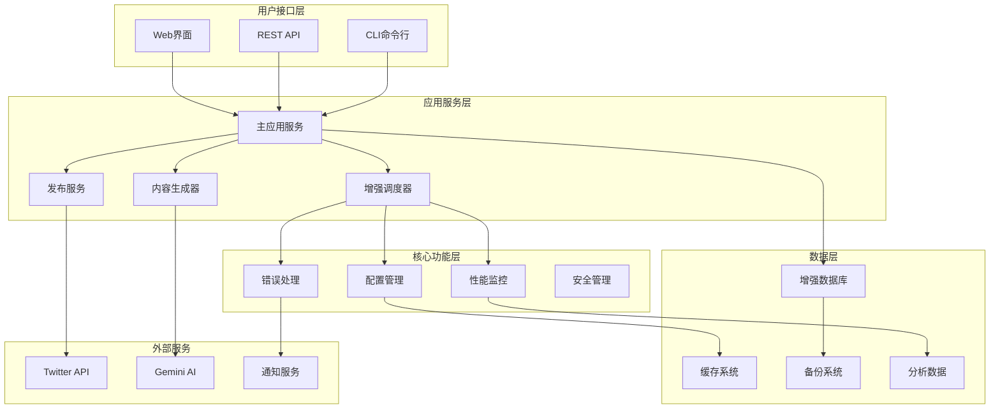
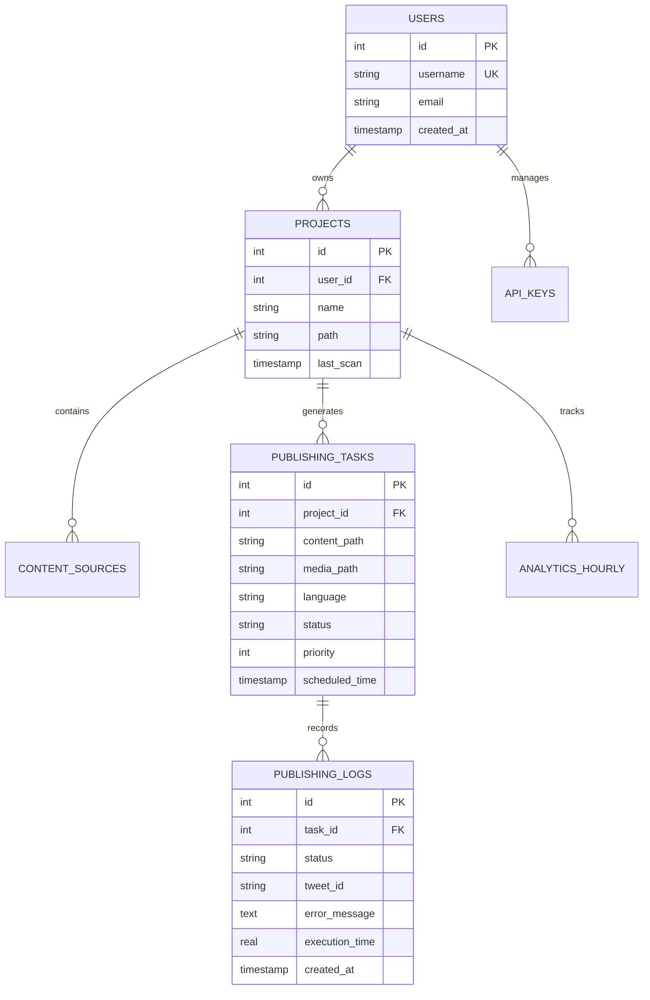

# 系统架构

## 系统概述

Twitter自动发布系统是一个企业级自动化内容发布平台，采用微服务化模块设计，集成了智能调度、性能监控、错误处理、数据分析等多项增强功能。

### 版本信息
- **版本**: v2.0.0
- **架构**: 微服务化模块设计
- **部署方式**: 支持本地部署、Docker容器化、云端部署
- **监控**: 实时性能监控和健康检查

## 整体架构

### 架构图



### 分层架构

#### 1. 用户接口层
- **CLI命令行**: 提供命令行工具，支持脚本化操作
- **REST API**: 标准化API接口，支持第三方集成
- **Web界面**: 直观的管理控制台，支持可视化操作

#### 2. 应用服务层
- **主应用服务**: 核心业务逻辑协调器
- **增强调度器**: 智能任务调度和管理
- **发布服务**: 社交媒体内容发布
- **内容生成器**: AI驱动的内容优化

#### 3. 核心功能层
- **配置管理**: 统一配置管理和热重载
- **错误处理**: 统一异常处理和恢复
- **性能监控**: 实时系统监控和告警
- **安全管理**: 认证授权和数据保护

#### 4. 数据层
- **增强数据库**: 支持多种数据库的ORM层
- **缓存系统**: 高性能数据缓存
- **备份系统**: 自动化数据备份和恢复
- **分析数据**: 业务数据分析和报告

## 核心组件

### 1. 增强数据库管理器 (EnhancedDatabaseManager)

**位置**: `app/database/db_manager.py`

**功能特性**:
- 智能数据库初始化和迁移
- 自动数据清理和优化
- 定期备份和恢复
- 健康状态监控
- 连接池管理

**核心方法**:
```python
class EnhancedDatabaseManager:
    def initialize_database(self, force_reset=False) -> Dict[str, Any]
    def clean_database(self, clean_tasks=True, clean_logs=True, days_to_keep=30) -> Dict[str, Any]
    def backup_database(self, backup_name=None) -> Dict[str, Any]
    def restore_database(self, backup_path) -> Dict[str, Any]
    def check_health(self) -> Dict[str, Any]
    def optimize_database(self) -> Dict[str, Any]
```

### 2. 增强任务调度器 (EnhancedTaskScheduler)

**位置**: `app/core/enhanced_scheduler.py`

**功能特性**:
- 智能任务优先级管理
- 并发控制和资源管理
- 高级重试机制
- 任务状态跟踪
- 性能优化

**调度策略**:
- **优先级调度**: 根据项目重要性和时间紧急性
- **负载均衡**: 动态调整并发任务数量
- **智能重试**: 指数退避 + 抖动算法
- **资源感知**: 根据系统资源动态调整

### 3. 增强配置管理 (EnhancedConfig)

**位置**: `app/utils/enhanced_config.py`

**功能特性**:
- 多环境配置支持
- 热重载配置更新
- 配置验证和类型检查
- 敏感信息加密
- 配置版本管理

**配置结构**:
```yaml
version: "2.0.0"
environment: "production"

scheduling:
  interval_hours: 24
  batch_size: 5
  max_concurrent_tasks: 3

performance:
  monitoring_enabled: true
  alert_thresholds:
    cpu_percent: 80
    memory_percent: 85

security:
  rate_limiting: true
  encryption_enabled: false
```

### 4. 错误处理和监控 (ErrorHandler)

**位置**: `app/utils/error_handler.py`

**功能特性**:
- 统一异常处理
- 错误分类和统计
- 自动恢复策略
- 多渠道告警通知
- 错误趋势分析

**错误分类**:
- **临时错误**: 网络超时、API限流
- **配置错误**: 密钥错误、权限不足
- **系统错误**: 磁盘满、内存不足
- **业务错误**: 内容格式错误、重复发布

### 5. 性能监控系统 (PerformanceMonitor)

**位置**: `app/utils/performance_monitor.py`

**监控指标**:
- **系统指标**: CPU、内存、磁盘、网络
- **应用指标**: 响应时间、吞吐量、错误率
- **业务指标**: 发布成功率、任务完成时间
- **资源指标**: 数据库连接、文件句柄

**告警机制**:
- **阈值告警**: 超过预设阈值触发
- **趋势告警**: 基于历史数据的异常检测
- **复合告警**: 多指标组合判断

## 数据模型

### 核心数据表

```sql
-- 用户表
CREATE TABLE users (
    id INTEGER PRIMARY KEY,
    username VARCHAR(50) UNIQUE NOT NULL,
    email VARCHAR(100),
    created_at TIMESTAMP DEFAULT CURRENT_TIMESTAMP
);

-- 项目表
CREATE TABLE projects (
    id INTEGER PRIMARY KEY,
    user_id INTEGER REFERENCES users(id),
    name VARCHAR(100) NOT NULL,
    path VARCHAR(500) NOT NULL,
    last_scan TIMESTAMP,
    UNIQUE(user_id, name)
);

-- 发布任务表
CREATE TABLE publishing_tasks (
    id INTEGER PRIMARY KEY,
    project_id INTEGER REFERENCES projects(id),
    content_path VARCHAR(500) NOT NULL,
    media_path VARCHAR(500),
    language VARCHAR(10) DEFAULT 'cn',
    status VARCHAR(20) DEFAULT 'pending',
    priority INTEGER DEFAULT 0,
    scheduled_time TIMESTAMP,
    created_at TIMESTAMP DEFAULT CURRENT_TIMESTAMP,
    UNIQUE(project_id, media_path)
);

-- 发布日志表
CREATE TABLE publishing_logs (
    id INTEGER PRIMARY KEY,
    task_id INTEGER REFERENCES publishing_tasks(id),
    status VARCHAR(20) NOT NULL,
    tweet_id VARCHAR(50),
    error_message TEXT,
    execution_time REAL,
    created_at TIMESTAMP DEFAULT CURRENT_TIMESTAMP
);

-- 性能指标表
CREATE TABLE performance_metrics (
    id INTEGER PRIMARY KEY,
    timestamp TIMESTAMP DEFAULT CURRENT_TIMESTAMP,
    cpu_percent REAL,
    memory_percent REAL,
    disk_percent REAL,
    active_tasks INTEGER,
    api_calls_count INTEGER,
    error_count INTEGER
);
```

### 数据关系图



## 部署架构

### 单机部署

```
┌─────────────────────────────────────┐
│           应用服务器                  │
├─────────────────────────────────────┤
│  ┌─────────────┐  ┌─────────────┐   │
│  │   主应用    │  │   调度器    │   │
│  └─────────────┘  └─────────────┘   │
│  ┌─────────────┐  ┌─────────────┐   │
│  │   监控      │  │   API服务   │   │
│  └─────────────┘  └─────────────┘   │
├─────────────────────────────────────┤
│  ┌─────────────┐  ┌─────────────┐   │
│  │  SQLite DB  │  │   文件存储  │   │
│  └─────────────┘  └─────────────┘   │
└─────────────────────────────────────┘
```

### Docker容器化部署

```
┌─────────────────────────────────────┐
│            Docker Host              │
├─────────────────────────────────────┤
│  ┌─────────────────────────────────┐ │
│  │     twitter-publisher           │ │
│  │  ┌─────────┐  ┌─────────────┐   │ │
│  │  │  应用   │  │    调度器   │   │ │
│  │  └─────────┘  └─────────────┘   │ │
│  │  ┌─────────┐  ┌─────────────┐   │ │
│  │  │  监控   │  │   API服务   │   │ │
│  │  └─────────┘  └─────────────┘   │ │
│  └─────────────────────────────────┘ │
├─────────────────────────────────────┤
│  ┌─────────────┐  ┌─────────────┐   │
│  │   数据卷    │  │   日志卷    │   │
│  └─────────────┘  └─────────────┘   │
└─────────────────────────────────────┘
```

### 云端分布式部署

```
┌─────────────────────────────────────┐
│            负载均衡器                │
└─────────────┬───────────────────────┘
              │
    ┌─────────┼─────────┐
    │         │         │
┌───▼───┐ ┌───▼───┐ ┌───▼───┐
│应用节点1│ │应用节点2│ │应用节点3│
└───────┘ └───────┘ └───────┘
    │         │         │
    └─────────┼─────────┘
              │
    ┌─────────▼─────────┐
    │     数据库集群     │
    │  ┌─────┐ ┌─────┐  │
    │  │主库 │ │从库 │  │
    └─────────────────────┘
```

## 安全架构

### 认证授权
- **API密钥认证**: 基于密钥的API访问控制
- **权限管理**: 基于角色的访问控制(RBAC)
- **会话管理**: 安全的会话生命周期管理

### 数据保护
- **传输加密**: HTTPS/TLS加密传输
- **存储加密**: 敏感数据加密存储
- **密钥管理**: 安全的密钥轮换和管理

### 安全监控
- **访问日志**: 详细的API访问记录
- **异常检测**: 异常访问模式检测
- **安全告警**: 实时安全事件通知

## 性能优化

### 缓存策略
- **配置缓存**: 热点配置数据缓存
- **查询缓存**: 数据库查询结果缓存
- **静态资源缓存**: 前端资源缓存

### 数据库优化
- **索引优化**: 关键字段索引设计
- **查询优化**: SQL查询性能优化
- **连接池**: 数据库连接池管理

### 并发控制
- **任务队列**: 异步任务处理
- **限流控制**: API请求频率限制
- **资源管理**: 系统资源使用控制

## 监控体系

### 系统监控
- **资源监控**: CPU、内存、磁盘、网络
- **服务监控**: 应用服务健康状态
- **依赖监控**: 外部服务可用性

### 业务监控
- **任务监控**: 发布任务执行状态
- **成功率监控**: 发布成功率统计
- **性能监控**: 响应时间和吞吐量

### 告警机制
- **实时告警**: 关键指标实时监控
- **趋势告警**: 基于历史数据的趋势分析
- **多渠道通知**: 邮件、短信、Webhook通知

---

**下一步**: 查看 [配置指南](04_配置指南.md) 了解详细的配置说明。