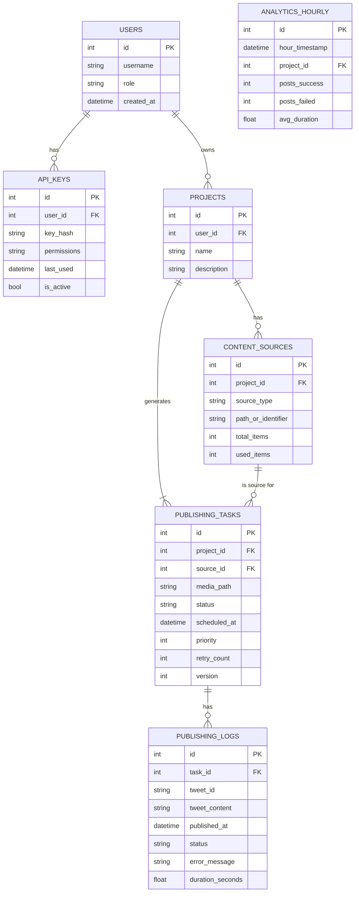

好的，我们来对数据库设计进行一次全面的强化升级。这次的设计将以 **API 化、统计分析、可扩展性**和**长期维护**为核心目标，将系统从一个独立的脚本工具提升为一个具备服务能力的数据驱动应用。

---

### **强化版数据库设计方案 (API-Ready & Analytics-Focused)**

#### **一、 核心设计原则与强化方向**

1.  **数据驱动与分析 (Data-Driven & Analytics)**: 数据库不仅是任务队列，更是数据金矿。我们将增加专门的统计和聚合表，为性能分析、内容策略优化提供直接的数据支持。
2.  **API 化支持 (API-Ready)**: 设计将解耦“谁在发布”（用户/API Key）和“发布什么”（内容），为未来提供 RESTful API 让其他服务或用户来创建发布任务打下基础。
3.  **可扩展性与模块化 (Scalability & Modularity)**: 引入“用户”、“内容库”等概念，使系统能支持多用户、多渠道、多内容源的复杂场景。
4.  **运维友好 (Ops-Friendly)**: 明确数据库的备份、清理和维护策略，确保长期稳定运行。

#### **二、 数据库设计注意事项 (关键实践)**

在深入设计之前，明确几个在整个开发过程中必须遵守的数据库操作准则：

*   **事务一致性 (ACID)**: 所有关联的写操作（`INSERT`, `UPDATE`, `DELETE`）必须被包裹在同一个事务中。例如，创建任务并扣减内容使用次数，这两个操作必须同时成功或失败。SQLAlchemy 的 Session 对象天生支持事务，善用 `session.commit()` 和 `session.rollback()`。
*   **并发控制 (Concurrency Control)**: 虽然初期可能是单线程，但设计应假设未来会有并发写入。
    *   **悲观锁 (Pessimistic Locking)**: 在取出任务进行处理时，可以使用 `SELECT ... FOR UPDATE`（在 SQLAlchemy 中通过 `with_for_update()` 实现）来锁定该行，防止其他进程也拿到同一个任务。
    *   **乐观锁 (Optimistic Locking)**: 在表中增加一个 `version` 字段。每次更新时，都 `UPDATE ... WHERE version = ?` 并将 `version` 加一。如果更新影响的行数为 0，说明数据已被其他进程修改，此时应回滚并重试。对于本应用，悲观锁更简单直接。
*   **主函数交互解耦**: 主函数（或任何业务逻辑）不应直接构造 SQL。它应调用一个明确的“数据服务层”或“仓库 (Repository)”模块，该模块封装了所有对数据库模型的增删改查操作。这使得业务逻辑更清晰，数据访问逻辑更集中。
*   **批量操作优化**: 对于大量数据的插入或更新，应使用 SQLAlchemy 的 `session.bulk_insert_mappings()` 或 `session.bulk_update_mappings()`，这比逐条 `add()` 性能高得多。
*   **数据安全**: 任何用户输入在存入数据库前都应经过严格的清洗和验证，防止注入攻击（虽然 ORM 已能防御大部分，但应用层验证仍是好习惯）。

#### **三、 强化版数据库详细设计**

**ER 图 (概念)**



**详细表结构与 SQL DDL**

---

**1. `users` 表**
*   **用途**: 支持多用户或多角色，为 API 化做准备。
*   **字段**:
    *   `id` (INTEGER): 主键。
    *   `username` (VARCHAR(255)): 用户名，唯一。
    *   `role` (VARCHAR(50)): 用户角色（如 'admin', 'editor'），用于权限控制。
    *   `created_at` (DATETIME): 创建时间。

```sql
CREATE TABLE users (
    id INTEGER PRIMARY KEY AUTOINCREMENT,
    username VARCHAR(255) NOT NULL UNIQUE,
    role VARCHAR(50) NOT NULL DEFAULT 'editor',
    created_at DATETIME NOT NULL DEFAULT CURRENT_TIMESTAMP
);
```

---

**2. `api_keys` 表**
*   **用途**: 为外部服务或脚本提供安全的认证方式。
*   **字段**:
    *   `id` (INTEGER): 主键。
    *   `user_id` (INTEGER): 关联的用户 (外键)。
    *   `key_hash` (VARCHAR(255)): 存储 API Key 的哈希值（如使用 SHA-256），而非明文。
    *   `permissions` (TEXT): JSON 格式的权限描述，如 `{"can_create_task": true, "can_read_status": true}`。
    *   `last_used` (DATETIME): 最后使用时间。
    *   `is_active` (BOOLEAN): 是否启用。

```sql
CREATE TABLE api_keys (
    id INTEGER PRIMARY KEY AUTOINCREMENT,
    user_id INTEGER NOT NULL,
    key_hash VARCHAR(255) NOT NULL UNIQUE,
    permissions TEXT,
    last_used DATETIME,
    is_active BOOLEAN NOT NULL DEFAULT 1,
    FOREIGN KEY (user_id) REFERENCES users (id)
);
```

---

**3. `projects` 表**
*   **用途**: 管理发布项目，现在与用户关联。
*   **字段**:
    *   `id` (INTEGER): 主键。
    *   `user_id` (INTEGER): 项目所有者 (外键)。
    *   `name` (VARCHAR(255)): 项目名称，在同一用户下唯一。
    *   `description` (TEXT): 项目描述。

```sql
CREATE TABLE projects (
    id INTEGER PRIMARY KEY AUTOINCREMENT,
    user_id INTEGER NOT NULL,
    name VARCHAR(255) NOT NULL,
    description TEXT,
    created_at DATETIME NOT NULL DEFAULT CURRENT_TIMESTAMP,
    UNIQUE (user_id, name),
    FOREIGN KEY (user_id) REFERENCES users (id)
);
```

---

**4. `content_sources` 表** (新增)
*   **用途**: 抽象化内容来源，不再局限于本地文件夹。
*   **字段**:
    *   `id` (INTEGER): 主键。
    *   `project_id` (INTEGER): 所属项目 (外键)。
    *   `source_type` (VARCHAR(50)): 来源类型，如 `'local_folder'`, `'google_drive'`, `'rss_feed'`。
    *   `path_or_identifier` (TEXT): 来源的路径或唯一标识符（如文件夹路径、云端目录ID）。
    *   `total_items` (INTEGER): 源中的总项目数。
    *   `used_items` (INTEGER): 已使用的项目数。

```sql
CREATE TABLE content_sources (
    id INTEGER PRIMARY KEY AUTOINCREMENT,
    project_id INTEGER NOT NULL,
    source_type VARCHAR(50) NOT NULL,
    path_or_identifier TEXT NOT NULL,
    total_items INTEGER DEFAULT 0,
    used_items INTEGER DEFAULT 0,
    last_scanned DATETIME,
    FOREIGN KEY (project_id) REFERENCES projects (id)
);
```

---

**5. `publishing_tasks` 表** (强化)
*   **用途**: 发布任务队列，更通用。
*   **字段**:
    *   `id` (INTEGER): 主键。
    *   `project_id` (INTEGER): 所属项目 (外键)。
    *   `source_id` (INTEGER): 任务的直接内容来源 (外键)。
    *   `media_path` (TEXT): 媒体文件的唯一标识符/路径。
    *   `content_data` (TEXT): 存储待发布的文本元数据 (JSON 格式)，不再依赖外部文件。
    *   `status` (VARCHAR(50)): 任务状态 (`'pending'`, `'locked'`, `'success'`, `'failed'`)。`locked` 替代 `in_progress`，更符合并发控制语义。
    *   `scheduled_at` (DATETIME): 计划发布时间。
    *   `priority` (INTEGER): 任务优先级（数字越大，优先级越高）。
    *   `retry_count` (INTEGER): 已重试次数。
    *   `version` (INTEGER): 乐观锁版本号。

```sql
CREATE TABLE publishing_tasks (
    id INTEGER PRIMARY KEY AUTOINCREMENT,
    project_id INTEGER NOT NULL,
    source_id INTEGER NOT NULL,
    media_path TEXT NOT NULL UNIQUE,
    content_data TEXT NOT NULL,
    status VARCHAR(50) NOT NULL DEFAULT 'pending',
    scheduled_at DATETIME NOT NULL,
    priority INTEGER NOT NULL DEFAULT 0,
    retry_count INTEGER NOT NULL DEFAULT 0,
    version INTEGER NOT NULL DEFAULT 1,
    created_at DATETIME NOT NULL DEFAULT CURRENT_TIMESTAMP,
    updated_at DATETIME NOT NULL DEFAULT CURRENT_TIMESTAMP,
    FOREIGN KEY (project_id) REFERENCES projects (id),
    FOREIGN KEY (source_id) REFERENCES content_sources (id)
);

-- 关键索引
CREATE INDEX ix_tasks_status_scheduled_priority ON publishing_tasks (status, scheduled_at, priority);
```

---

**6. `publishing_logs` 表** (强化)
*   **用途**: 发布历史与性能数据。
*   **字段**:
    *   `id` (INTEGER): 主键。
    *   `task_id` (INTEGER): 关联任务 (外键)。
    *   `tweet_id` (VARCHAR(255)): 发布的推文 ID。
    *   `tweet_content` (TEXT): 发布的文本。
    *   `published_at` (DATETIME): 发布时间。
    *   `status` (VARCHAR(50)): 本次尝试结果 (`'success'`, `'failed'`)。
    *   `error_message` (TEXT): 错误信息。
    *   `duration_seconds` (FLOAT): 从任务被锁定到处理完成的总耗时。

```sql
CREATE TABLE publishing_logs (
    id INTEGER PRIMARY KEY AUTOINCREMENT,
    task_id INTEGER NOT NULL,
    tweet_id VARCHAR(255),
    tweet_content TEXT,
    published_at DATETIME NOT NULL,
    status VARCHAR(50) NOT NULL,
    error_message TEXT,
    duration_seconds FLOAT,
    FOREIGN KEY (task_id) REFERENCES publishing_tasks (id)
);
```

---

**7. `analytics_hourly` 表** (新增，用于统计)
*   **用途**: 预先聚合的统计数据，用于快速生成报表，避免每次都对 `logs` 表进行全量扫描。
*   **字段**:
    *   `id` (INTEGER): 主键。
    *   `hour_timestamp` (DATETIME): 统计的小时时间戳 (如 `2023-10-27 15:00:00`)。
    *   `project_id` (INTEGER): 关联的项目 (外键)。
    *   `posts_success` (INTEGER): 该小时内成功发布的数量。
    *   `posts_failed` (INTEGER): 该小时内失败的数量。
    *   `avg_duration` (FLOAT): 该小时内成功任务的平均耗时。

```sql
CREATE TABLE analytics_hourly (
    id INTEGER PRIMARY KEY AUTOINCREMENT,
    hour_timestamp DATETIME NOT NULL,
    project_id INTEGER NOT NULL,
    posts_success INTEGER NOT NULL DEFAULT 0,
    posts_failed INTEGER NOT NULL DEFAULT 0,
    avg_duration FLOAT,
    UNIQUE (hour_timestamp, project_id),
    FOREIGN KEY (project_id) REFERENCES projects (id)
);
```

#### **四、 数据库备份、清理与维护机制**

1.  **备份机制 (Backup)**
    *   **策略**: 每日全量备份。
    *   **实现**:
        *   **SQLite**: 编写一个简单的 shell 脚本，使用 `sqlite3` 命令行工具的 `.backup` 命令。
          ```sh
          #!/bin/bash
          DB_PATH="/path/to/your/app.db"
          BACKUP_DIR="/path/to/backups"
          TIMESTAMP=$(date +"%Y%m%d_%H%M%S")
          sqlite3 $DB_PATH ".backup '$BACKUP_DIR/backup_$TIMESTAMP.db'"
          ```
        *   **自动化**: 将此脚本添加到 `cron` 作业中，每天凌晨执行。
        *   **异地备份**: 将备份文件定期同步到云存储（如 AWS S3, Google Cloud Storage），防止服务器物理损坏。

2.  **清理机制 (Cleanup/Purge)**
    *   **策略**: 定期归档或删除旧数据，防止数据库无限膨胀。
    *   **实现**:
        *   创建一个 CLI 命令 `python app/main.py db:purge`。
        *   该命令可以带参数，例如 `--days=180 --table=logs`。
        *   **逻辑**: 删除 `publishing_logs` 表中 `published_at` 早于 180 天前的记录。注意，不应删除 `publishing_tasks`，因为它们是核心业务记录。`analytics_*` 表数据量小，一般无需清理。
        *   **自动化**: 将此命令也加入 `cron`，每月执行一次。

3.  **维护机制 (Maintenance)**
    *   **策略**: 定期对数据库进行优化。
    *   **实现**:
        *   创建一个 CLI 命令 `python app/main.py db:vacuum`。
        *   **逻辑**:
            *   执行 SQLite 的 `VACUUM;` 命令。此命令会重建数据库文件，移除空闲页，减小文件尺寸。
            *   执行 `ANALYZE;` 命令。此命令会收集关于索引的统计信息，帮助查询优化器做出更好的决策。
        *   **自动化**: 在数据清理后，或每月一次，通过 `cron` 运行此维护命令。

这个强化版数据库设计方案不仅满足了您当前的需求，更为系统的未来发展铺平了道路，使其能够演变成一个功能更强大、更具服务能力和商业价值的应用。