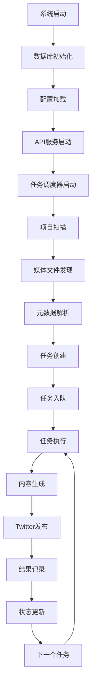
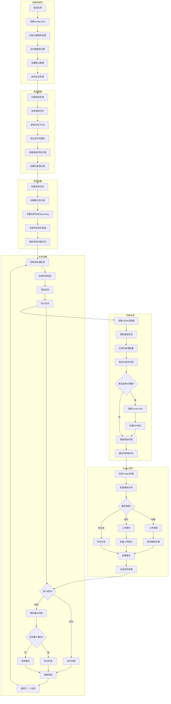
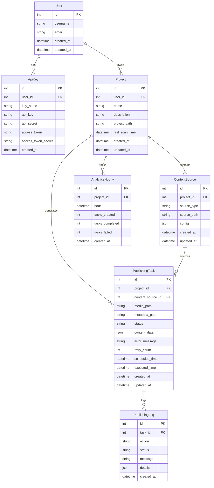
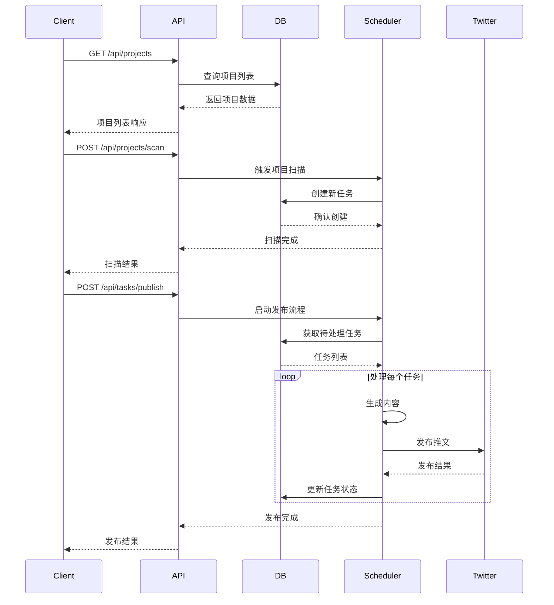
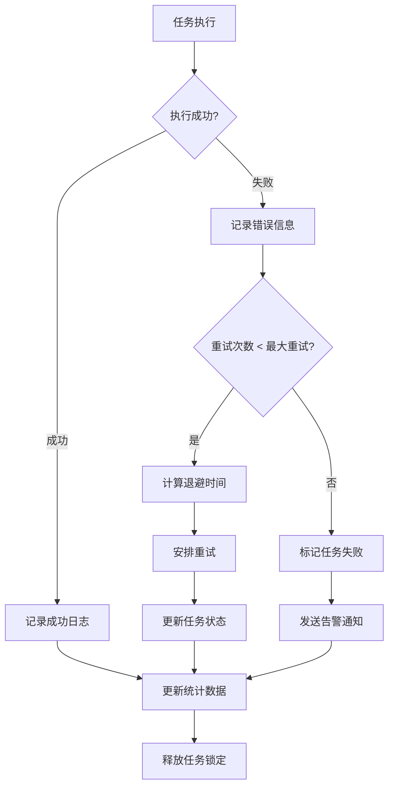
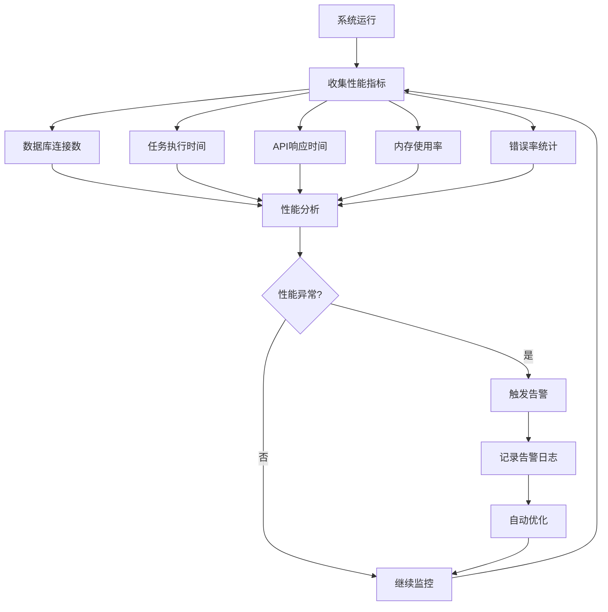

# Twitter自动发布系统流程图

## 系统整体架构流程

```mermaid
flowchart TD
    A[系统启动] --> B[数据库初始化]
    B --> C[配置加载]
    C --> D[API服务启动]
    D --> E[任务调度器启动]
    
    F[项目扫描] --> G[媒体文件发现]
    G --> H[元数据解析]
    H --> I[任务创建]
    I --> J[任务入队]
    
    K[任务执行] --> L[内容生成]
    L --> M[Twitter发布]
    M --> N[结果记录]
    N --> O[状态更新]
    
    E --> F
    J --> K
    O --> P[下一个任务]
    P --> K
```

## 详细数据流程图

```mermaid
flowchart TD
    subgraph "系统初始化"
        A1[启动应用] --> A2[加载config.yaml]
        A2 --> A3[初始化数据库连接]
        A3 --> A4[运行数据库迁移]
        A4 --> A5[创建默认数据]
        A5 --> A6[启动日志系统]
    end
    
    subgraph "项目管理"
        B1[扫描项目目录] --> B2[发现视频文件]
        B2 --> B3[查找对应JSON]
        B3 --> B4[验证文件完整性]
        B4 --> B5[创建/更新项目记录]
        B5 --> B6[创建内容源记录]
    end
    
    subgraph "任务创建"
        C1[检查现有任务] --> C2[创建新任务记录]
        C2 --> C3[设置任务状态为pending]
        C3 --> C4[关联项目和内容源]
        C4 --> C5[更新项目扫描时间]
    end
    
    subgraph "内容生成"
        D1[读取JSON元数据] --> D2[提取基础信息]
        D2 --> D3[应用内容源配置]
        D3 --> D4[格式化推文内容]
        D4 --> D5{是否启用AI增强?}
        D5 -->|是| D6[调用Gemini API]
        D5 -->|否| D7[使用原始内容]
        D6 --> D8[处理API响应]
        D8 --> D7
        D7 --> D9[最终内容格式化]
    end
    
    subgraph "Twitter发布"
        E1[验证Twitter凭据] --> E2[检查媒体文件]
        E2 --> E3{媒体类型?}
        E3 -->|视频| E4[上传视频]
        E3 -->|图片| E5[上传图片]
        E3 -->|纯文本| E6[发布文本]
        E4 --> E7[等待媒体处理]
        E5 --> E8[批量上传图片]
        E7 --> E9[创建推文]
        E8 --> E9
        E6 --> E9
        E9 --> E10[记录发布结果]
    end
    
    subgraph "任务调度"
        F1[获取待处理任务] --> F2[检查任务锁定]
        F2 --> F3[锁定任务]
        F3 --> F4[执行任务]
        F4 --> F5{执行成功?}
        F5 -->|成功| F6[标记完成]
        F5 -->|失败| F7[增加重试次数]
        F7 --> F8{达到最大重试?}
        F8 -->|是| F9[标记失败]
        F8 -->|否| F10[安排重试]
        F6 --> F11[释放锁定]
        F9 --> F11
        F10 --> F11
        F11 --> F12[调度下一个任务]
    end
    
    A6 --> B1
    B6 --> C1
    C5 --> F1
    F4 --> D1
    D9 --> E1
    E10 --> F5
    F12 --> F1
```

## 数据库关系图

```mermaid
erDiagram
    User {
        int id PK
        string username
        string email
        datetime created_at
        datetime updated_at
    }
    
    ApiKey {
        int id PK
        int user_id FK
        string key_name
        string api_key
        string api_secret
        string access_token
        string access_token_secret
        datetime created_at
    }
    
    Project {
        int id PK
        int user_id FK
        string name
        string description
        string project_path
        datetime last_scan_time
        datetime created_at
        datetime updated_at
    }
    
    ContentSource {
        int id PK
        int project_id FK
        string source_type
        string source_path
        json config
        datetime created_at
        datetime updated_at
    }
    
    PublishingTask {
        int id PK
        int project_id FK
        int content_source_id FK
        string media_path
        string metadata_path
        string status
        json content_data
        string error_message
        int retry_count
        datetime scheduled_time
        datetime executed_time
        datetime created_at
        datetime updated_at
    }
    
    PublishingLog {
        int id PK
        int task_id FK
        string action
        string status
        string message
        json details
        datetime created_at
    }
    
    AnalyticsHourly {
        int id PK
        int project_id FK
        datetime hour
        int tasks_created
        int tasks_completed
        int tasks_failed
        datetime created_at
    }
    
    User ||--o{ ApiKey : has
    User ||--o{ Project : owns
    Project ||--o{ ContentSource : contains
    Project ||--o{ PublishingTask : generates
    Project ||--o{ AnalyticsHourly : tracks
    ContentSource ||--o{ PublishingTask : sources
    PublishingTask ||--o{ PublishingLog : logs
```

## API接口流程图

```mermaid
sequenceDiagram
    participant Client
    participant API
    participant DB
    participant Scheduler
    participant Twitter
    
    Client->>API: GET /api/projects
    API->>DB: 查询项目列表
    DB-->>API: 返回项目数据
    API-->>Client: 项目列表响应
    
    Client->>API: POST /api/projects/scan
    API->>Scheduler: 触发项目扫描
    Scheduler->>DB: 创建新任务
    DB-->>Scheduler: 确认创建
    Scheduler-->>API: 扫描完成
    API-->>Client: 扫描结果
    
    Client->>API: POST /api/tasks/publish
    API->>Scheduler: 启动发布流程
    Scheduler->>DB: 获取待处理任务
    DB-->>Scheduler: 任务列表
    
    loop 处理每个任务
        Scheduler->>Scheduler: 生成内容
        Scheduler->>Twitter: 发布推文
        Twitter-->>Scheduler: 发布结果
        Scheduler->>DB: 更新任务状态
    end
    
    Scheduler-->>API: 发布完成
    API-->>Client: 发布结果
```

## 错误处理流程图

```mermaid
flowchart TD
    A[任务执行] --> B{执行成功?}
    B -->|成功| C[记录成功日志]
    B -->|失败| D[记录错误信息]
    D --> E{重试次数 < 最大重试?}
    E -->|是| F[计算退避时间]
    F --> G[安排重试]
    G --> H[更新任务状态]
    E -->|否| I[标记任务失败]
    I --> J[发送告警通知]
    C --> K[更新统计数据]
    H --> K
    J --> K
    K --> L[释放任务锁定]
```

## 性能监控流程图

```mermaid
flowchart TD
    A[系统运行] --> B[收集性能指标]
    B --> C[数据库连接数]
    B --> D[任务执行时间]
    B --> E[API响应时间]
    B --> F[内存使用率]
    B --> G[错误率统计]
    
    C --> H[性能分析]
    D --> H
    E --> H
    F --> H
    G --> H
    
    H --> I{性能异常?}
    I -->|是| J[触发告警]
    I -->|否| K[继续监控]
    J --> L[记录告警日志]
    L --> M[自动优化]
    M --> K
    K --> B
```