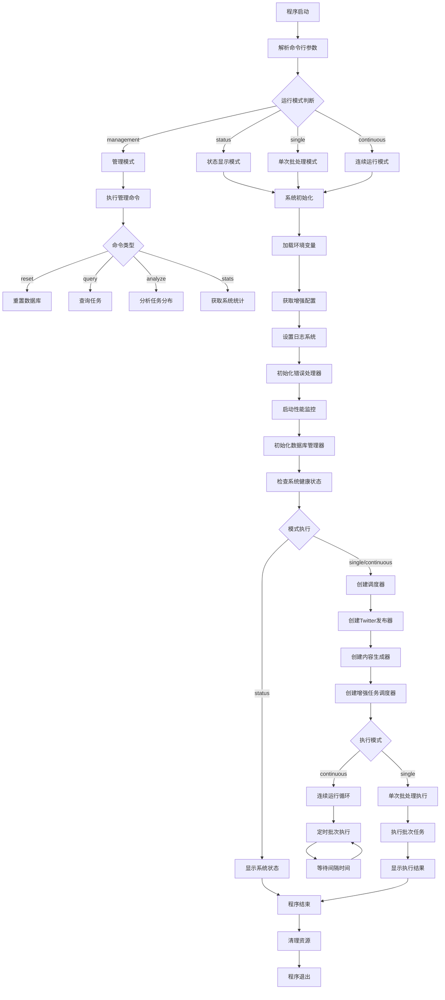
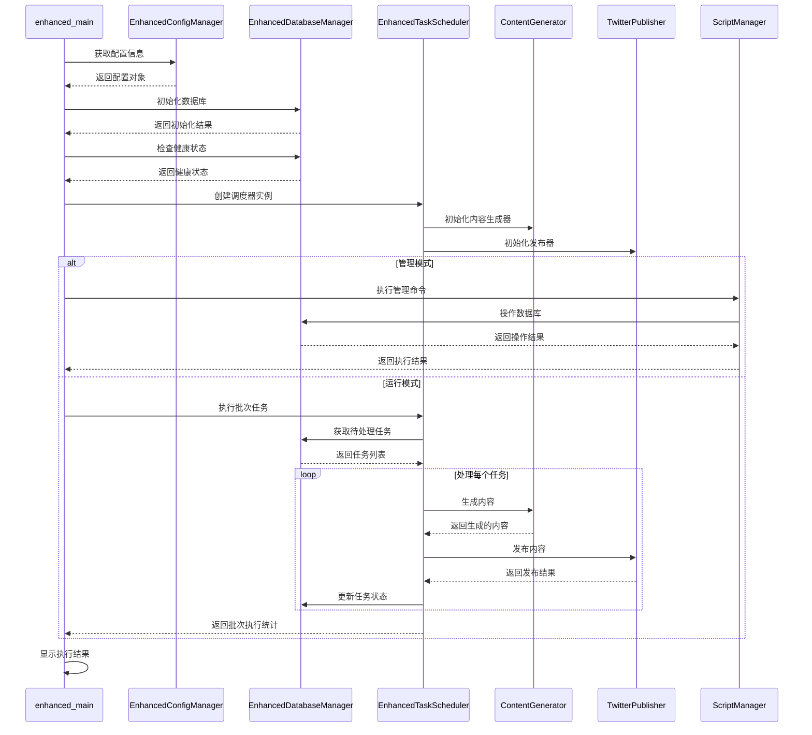
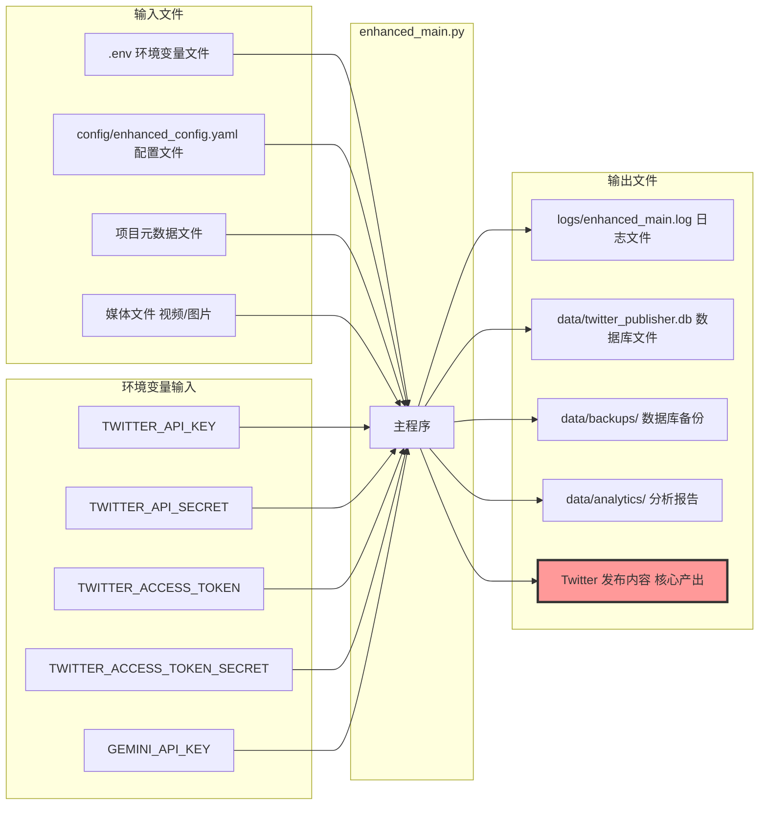
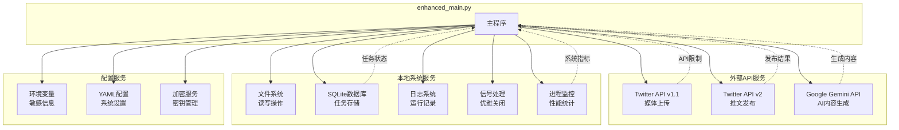
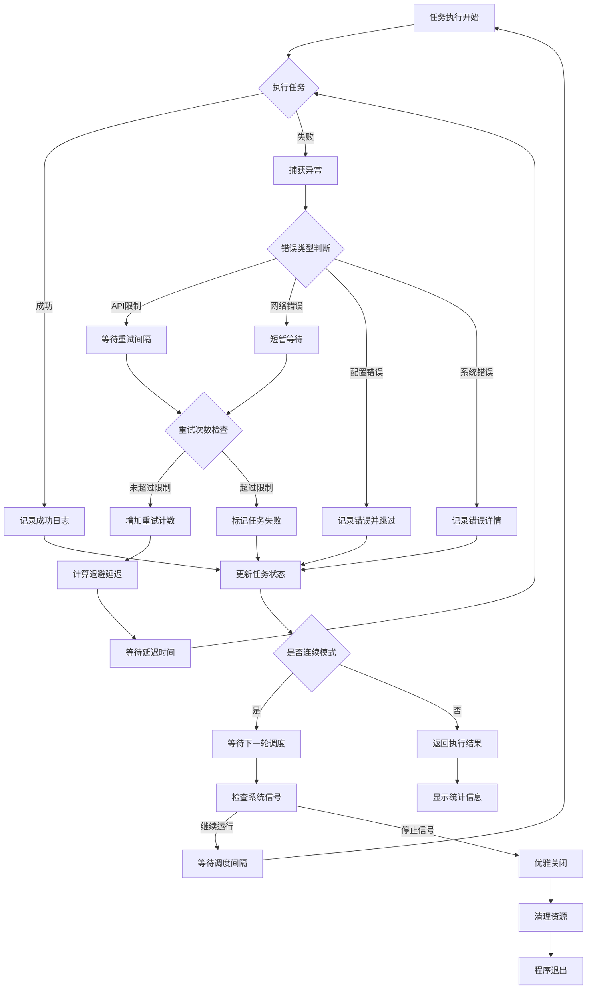
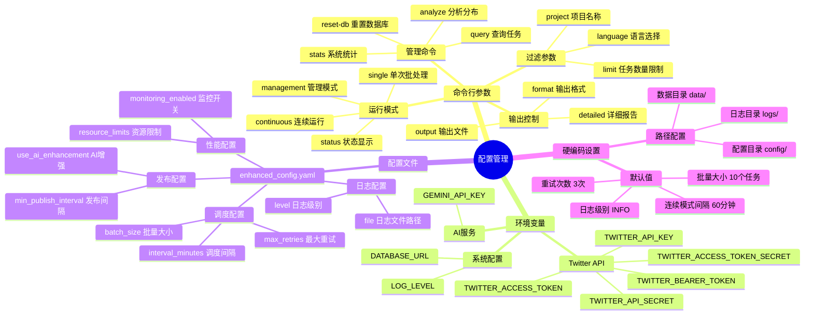

# enhanced_main.py 技术分析报告

## 1. 文件概述

enhanced_main.py 是一个增强版的 Twitter 自动发布系统的统一启动脚本，整合了任务调度、内容生成、数据库管理、性能监控等核心功能，支持连续运行、单次批处理、状态查看和管理等多种运行模式。

## 2. 数据流和处理流程图



## 3. 核心类和服务依赖关系

```mermaid
classDiagram
    class EnhancedMain {
        +scheduler: EnhancedTaskScheduler
        +running: bool
        +logger: Logger
        +signal_handler()
        +initialize_system()
        +create_scheduler()
        +run_continuous_mode()
        +run_single_batch()
        +show_system_status()
        +run_management_mode()
        +main()
    }
    
    class EnhancedConfigManager {
        +config_path: str
        +environment: str
        +get()
        +set()
        +update()
        +reload_config()
        +encrypt_field()
    }
    
    class EnhancedDatabaseManager {
        +db_url: str
        +initialize_database()
        +clean_database()
        +backup_database()
        +check_health()
        +get_database_stats()
    }
    
    class EnhancedTaskScheduler {
        +db_manager: EnhancedDatabaseManager
        +content_generator: ContentGenerator
        +publisher: TwitterPublisher
        +start()
        +stop()
        +run_batch()
        +schedule_task()
        +get_stats()
    }
    
    class ContentGenerator {
        +use_ai: bool
        +gemini_api_key: str
        +model: GenerativeModel
        +generate_tweet()
        +generate_tweet_from_data()
        +format_tweet()
    }
    
    class TwitterPublisher {
        +api_key: str
        +api_secret: str
        +access_token: str
        +access_token_secret: str
        +client_v2: Client
        +api_v1: API
        +post_tweet_with_video()
        +post_tweet_with_images()
        +post_text_tweet()
    }
    
    class ScriptManager {
        +reset_manager: DatabaseResetManager
        +query_manager: TaskQueryManager
        +analyzer: TaskAnalyzer
        +execute_command()
        +reset_database()
        +query_tasks()
        +analyze_tasks()
    }
    
    class PerformanceMonitor {
        +get_current_metrics()
        +start_monitoring()
        +stop_monitoring()
    }
    
    class ErrorHandler {
        +handle_error()
        +log_error()
        +retry_operation()
    }
    
    EnhancedMain --> EnhancedConfigManager : uses
    EnhancedMain --> EnhancedDatabaseManager : creates
    EnhancedMain --> EnhancedTaskScheduler : creates
    EnhancedMain --> ScriptManager : uses
    EnhancedMain --> PerformanceMonitor : uses
    EnhancedMain --> ErrorHandler : uses
    
    EnhancedTaskScheduler --> EnhancedDatabaseManager : depends on
    EnhancedTaskScheduler --> ContentGenerator : uses
    EnhancedTaskScheduler --> TwitterPublisher : uses
    
    ContentGenerator --> "Google Gemini API" : calls
    TwitterPublisher --> "Twitter API v1.1" : calls
    TwitterPublisher --> "Twitter API v2" : calls
```

## 4. 数据传递链条



## 5. 文件输入输出关系



## 6. 外部服务调用



## 7. 错误处理和重试机制



## 8. 配置和参数管理



## 9. 核心功能与逻辑摘要

### 主要功能特点

1. **多模式运行架构**: 系统采用模块化设计，支持连续运行、单次批处理、状态查看和管理四种运行模式，通过命令行参数灵活切换。

2. **增强型任务调度**: 集成了智能重试机制、任务优先级管理、并发控制和性能监控，确保任务执行的可靠性和效率。

3. **配置管理系统**: 采用分层配置策略，支持环境变量、YAML配置文件和命令行参数的优先级覆盖，并提供配置热重载和加密功能。

4. **错误处理与恢复**: 实现了完善的异常处理机制，包括分类错误处理、指数退避重试、优雅关闭和资源清理。

5. **外部服务集成**: 无缝集成Twitter API v1.1/v2和Google Gemini API，支持多媒体内容发布和AI内容增强。

### 设计模式应用

- **单例模式**: 配置管理器使用单例模式确保全局配置一致性
- **工厂模式**: 调度器、发布器和内容生成器的创建采用工厂模式
- **观察者模式**: 配置文件变化监听和性能监控采用观察者模式
- **策略模式**: 不同运行模式的执行策略采用策略模式

### 关键技术特性

- **信号处理**: 实现了SIGINT和SIGTERM信号的优雅处理，确保系统安全关闭
- **并发控制**: 使用ThreadPoolExecutor进行任务并发执行，提高处理效率
- **资源管理**: 自动管理数据库连接、API客户端和文件句柄等资源
- **性能监控**: 实时监控CPU、内存、磁盘使用率和API调用频率
- **数据持久化**: 使用SQLite数据库存储任务状态和执行日志，支持备份和恢复

### 扩展性设计

系统采用松耦合架构，各模块间通过接口交互，便于功能扩展和维护。支持插件式的内容源配置、多语言内容生成和多平台发布扩展。配置系统支持动态加载，可在运行时调整系统行为而无需重启。